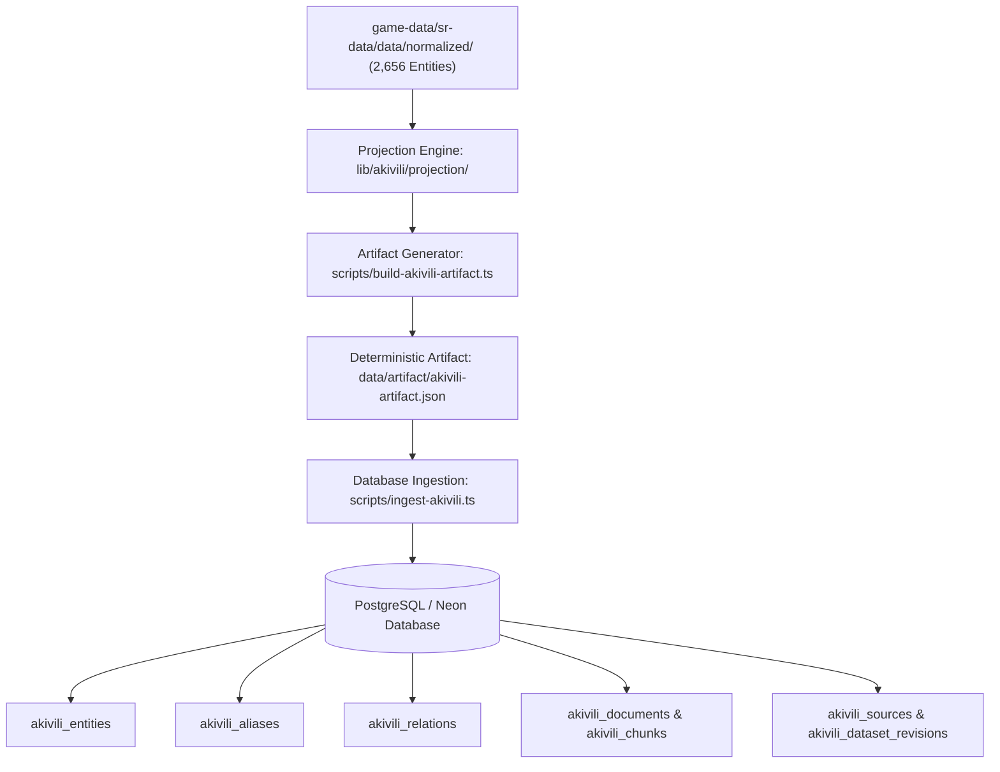

# E-Akivili Architecture & Ingestion Plan

This document outlines the end-to-end plan for integrating the Honkai: Star Rail normalized game data from `../game-data/sr-data` into `e-akivili`, maintaining backend and schema parity with `e-teyvat`.

---

## 1. High-Level Architecture Overview

---

## 2. Database Schema (`db/schema.ts`)

Mirrors the `e-teyvat` schema with namespace `hsr` and table prefix `akivili_`:

### A. Tables
1. **`akivili_sources`**:
   - `hoyoverse`: Intellectual Property & Asset rights.
   - `project-yatta`: Community API provider (`sr.yatta.moe`).
   - `prydwen`: Theorycrafting, character ratings, and build recommendations.
   - `e-akivili`: Application metadata.
2. **`akivili_entities`**:
   - `id`: Unique identifier (e.g. `hsr:character:1001`, `hsr:lightcone:20000`, `hsr:relic_set:101`).
   - `namespace`: `hsr`
   - `kind`: `character`, `lightcone`, `relic_set`, `item`, `book`, `message`.
   - `slug`: URL-friendly identifier (e.g. `march-7th`, `arrows`).
   - `name`: English display name.
   - `data`: JSONB payload containing stats, path, combat type, rarity, traces, eidolons.
   - `provenance` & `temporal`: JSONB attribution & version metadata (`4.5`).
3. **`akivili_aliases`**:
   - `id`, `entityId`, `alias`, `normalizedAlias`.
   - Supports instant multilingual search (`cn`, `cht`, `jp`, `kr`, `de`, `es`, `fr`, etc.).
4. **`akivili_relations`**:
   - `id`, `subjectId`, `predicate`, `objectId`.
   - Triples linking characters to required ascension items, signature light cones, and relic sets.
5. **`akivili_documents` & `akivili_chunks`**:
   - `id`, `sourceId`, `entityId`, `title`, `content`, `format`, `tokenCount`.
   - Contains lore texts, readable books (811 items), and daily messaging logs (767 conversations).
6. **`akivili_dataset_revisions`**:
   - Tracking deterministic revision hashes and migration checkpoints.

---

## 3. Implementation Phases

### Phase 1: Infrastructure & Database Layer
- Install dependencies: `@neondatabase/serverless`, `drizzle-orm`, `dotenv`, `drizzle-kit`.
- Create `db/schema.ts`, `db/client.ts`, and `drizzle.config.ts`.
- Setup `.env.local` with `DATABASE_URL`.

### Phase 2: Projection & Transformation Engine (`lib/akivili/`)
- `lib/akivili/projection/input.ts`: Read normalized data from `../game-data/sr-data/data/normalized/`.
- `lib/akivili/projection/index.ts`: Project canonical entities into database-ready structures (slugs, relationships, alias normalization).
- `lib/akivili/projection/validate.ts`: Enforce referential integrity and SHA-256 validation.

### Phase 3: Artifact Generation (`scripts/build-akivili-artifact.ts`)
- Compile projection into `data/artifact/akivili-artifact.json` and `manifest.json`.
- Compute content hashes and entity counts to guarantee reproducibility.

### Phase 4: Ingestion Engine (`scripts/ingest-akivili.ts`)
- Execute transactional database wipe and chunked bulk insert (`CHUNK_SIZE = 250`).
- Validate table counts against manifest checkpoints.

### Phase 5: Query & API Layer (`app/api/`)
- Expose search endpoints for characters, light cones, relics, and lore.
- Provide multilingual entity resolution.
